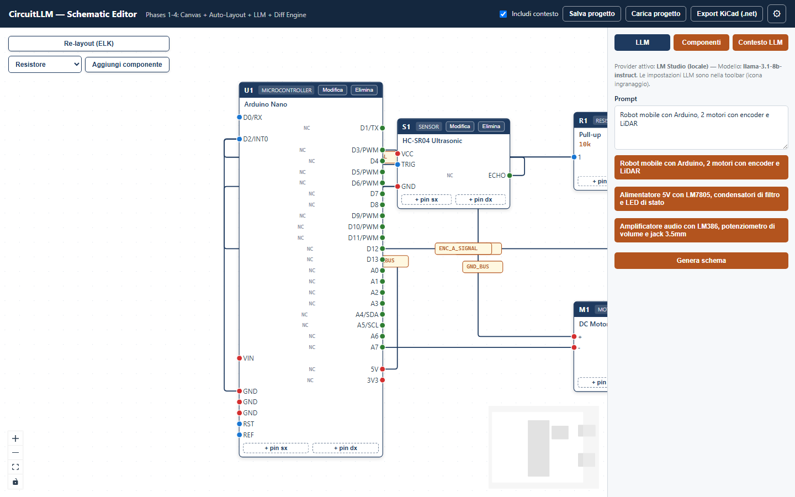
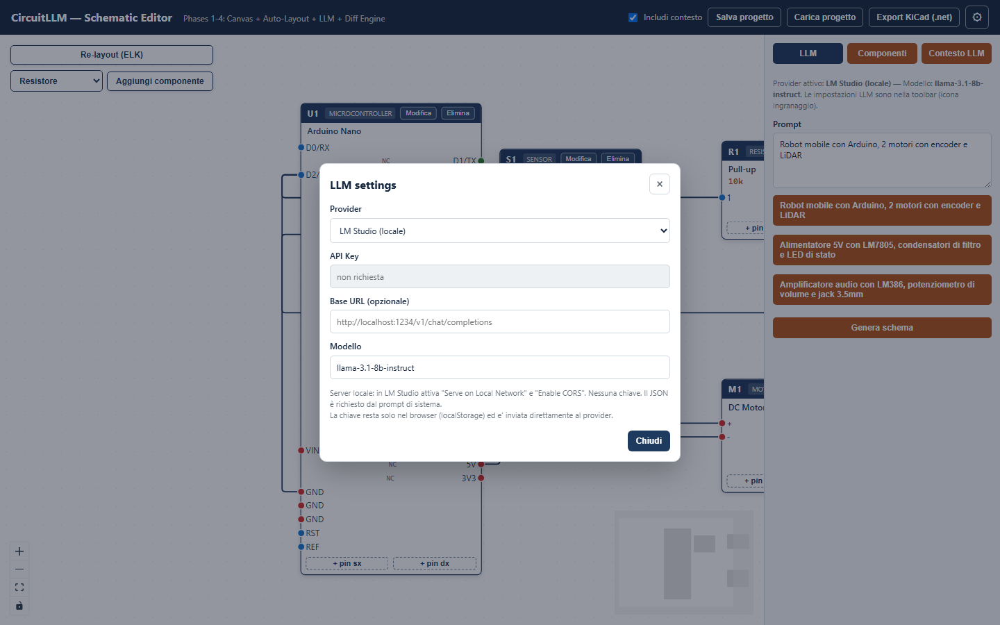
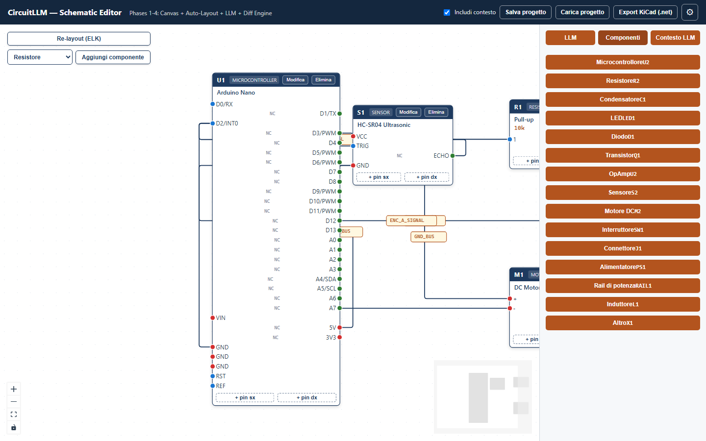
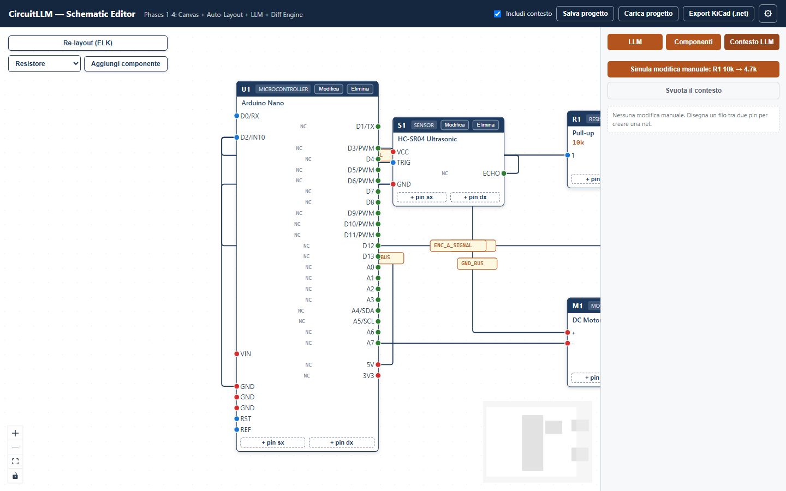

# CircuitLLM

Editor schematico web con **canvas interattivo**, **auto-layout ELK**, integrazione **LLM multi-provider** e ciclo bidirezionale **Canvas → Diff → Prompt LLM**.

Genera schemi elettrici da linguaggio naturale, modifica manualmente componenti e connessioni, salva il progetto con memoria compatta del contesto e export verso KiCad.

**Demo online:** [https://circuitllm.netlify.app/](https://circuitllm.netlify.app/)



## Funzionalità

- **Canvas schematico** con React Flow: componenti, pin, wire, selezione evidenziata
- **Auto-layout ELK** con fallback a griglia
- **Generazione LLM** da prompt (OpenAI, Anthropic, Gemini, LM Studio)
- **Modifica multi-turno** dello schema corrente
- **Diff engine**: le modifiche manuali al canvas alimentano il contesto LLM
- **Palette componenti** e aggiunta rapida dal canvas
- **Pin custom** a sinistra/destra, rinomina componenti, eliminazione componenti
- **Salva / Carica progetto** (`.circuitllm.json`)
- **Memoria progetto opzionale** con compaction LLM incrementale
- **Export KiCad** netlist (`.net`)

## Screenshot

| Vista | Descrizione |
|---|---|
|  | Editor con circuito di esempio e toolbar |
|  | Pannello LLM per generazione e modifica schema |
|  | Dialog impostazioni provider LLM |
|  | Palette componenti nella sidebar |
|  | Tab contesto LLM (delta manuali) |

## Requisiti

- **Node.js** 20+ (consigliato LTS)
- Browser moderno (Chrome, Edge, Firefox)
- Per LLM cloud: API key del provider scelto
- Per LLM locale: [LM Studio](https://lmstudio.ai/) con server attivo

## Installazione e avvio (Windows)

```powershell
git clone https://github.com/fra00/CircuitLLM.git
cd CircuitLLM
npm install
npm run dev
```

Apri nel browser: **http://localhost:5173/**

Se `npm` non è riconosciuto, aggiungi Node.js al PATH:

```powershell
$env:Path = "C:\Program Files\nodejs;$env:Path"
```

Comandi utili:

```powershell
npm run dev      # sviluppo con hot reload
npm run build    # build produzione
npm run preview  # anteprima build
npm run lint     # controllo codice (oxlint)
npm test         # unit test (vitest)
npm run test:watch
npm run test:coverage
```

### Qualità e CI

- **Pre-push locale** (Husky): ogni `git push` esegue **tutti** gli unit test (`npm test`). Se anche uno fallisce, la push viene **rifiutata**.
- **Pre-commit**: esegue `npm run lint`
- **GitHub Actions**: su push/PR verso `main` gira lint + test + build
- Non usare `git push --no-verify` per saltare i controlli

Su GitHub, in *Settings → Branches → Branch protection* su `main`, abilita **Require status checks** e seleziona il check `Lint, test, build` così anche push forzate/CI fallite non entrano in main.

Repository: [github.com/fra00/CircuitLLM](https://github.com/fra00/CircuitLLM)

## Pubblicazione su Netlify

L’app è pubblicata su Netlify:

**https://circuitllm.netlify.app/**

Deploy automatico dal branch `main` del repository GitHub. Impostazioni build:

| Campo | Valore |
|--------|--------|
| Build command | `npm run build` |
| Publish directory | `dist` |
| Node.js | `20` o `22` |

In locale puoi riprodurre la build di produzione con:

```powershell
npm run build
npm run preview
```

## Guida rapida

### 1. Generare uno schema con LLM

1. Apri il tab **LLM** nella sidebar destra
2. Clicca l'icona **⚙** in toolbar → **LLM settings**
3. Scegli provider, modello e API key (se richiesta)
4. Scrivi un prompt, ad es. *"Robot mobile con Arduino, 2 motori con encoder e LiDAR"*
5. Clicca **Genera schema**

Il circuito generato sostituisce lo schema corrente e attiva la modalità modifica multi-turno.

### 2. Modificare manualmente il canvas

- **Aggiungere componenti**: tab **Componenti** oppure selettore + **Aggiungi componente** nel canvas
- **Collegare pin**: trascina un wire tra due handle
- **Wire selezionato**: evidenziato in blu con spessore maggiore
- **Rimuovere wire**: clic sulla × sull'etichetta net
- **Modificare componente**: pulsante **Modifica** nell'header del nodo (codice + nome)
- **Aggiungere pin**: `+ pin sx` / `+ pin dx`
- **Eliminare componente**: pulsante **Elimina** nell'header del nodo
- **Re-layout**: **Re-layout (ELK)** nel pannello canvas

Le modifiche manuali compaiono nel tab **Contesto LLM** e vengono rispettate nelle prossime generazioni.

### 3. Applicare modifiche via LLM

Dopo la prima generazione, i prompt successivi **modificano lo schema attuale** (non lo rigenerano da zero).

Esempi:
- *"Aggiungi un condensatore da 100uF in uscita sull'alimentazione"*
- *"Aumenta la resistenza R1 da 10k a 22k"*

Usa **Nuovo schema (azzera contesto)** per ricominciare da zero.

### 4. Salvare e caricare un progetto

Toolbar:
- **Salva progetto** → scarica `<nome>.circuitllm.json`
- **Carica progetto** → ripristina circuito (e contesto se presente)
- **Includi contesto** (checkbox):
  - **ON**: salva anche memoria LLM compatta (`goal`, `summary`)
  - **OFF**: salva solo topologia circuito

#### Memoria progetto (contesto compatto)

Con **Includi contesto** attivo, al salvataggio:
1. **Primo save** → compaction LLM completa del contesto sessione
2. **Save successivi** → compaction incrementale (summary + solo novità)
3. **Nessuna modifica** → riuso summary esistente (nessuna chiamata LLM)

Al reload, la memoria viene reiniettata nel prompt di sistema.

### 5. Export KiCad

**Export KiCad (.net)** genera una netlist XML compatibile con KiCad (componenti + connessioni).

> Nota: l'export produce una **netlist**, non un file schematico `.kicad_sch` completo.

## Provider LLM supportati

| Provider | Default model | API key |
|---|---|---|
| OpenAI | `gpt-4o-mini` | Sì |
| Anthropic | `claude-sonnet-4-20250514` | Sì |
| Gemini | `gemini-3-flash-preview` | Sì |
| LM Studio | locale | No |

Le impostazioni LLM restano nel browser (`localStorage`).

### LM Studio (locale)

1. Avvia LM Studio e carica un modello instruct
2. Attiva **Serve on Local Network** e **Enable CORS**
3. In CircuitLLM seleziona **LM Studio (locale)**
4. Endpoint default: `http://localhost:1234/v1/chat/completions`

## Formato progetto

File `.circuitllm.json` (versione 2):

```json
{
  "version": 2,
  "kind": "circuitllm-project",
  "savedAt": "2026-08-12T12:00:00.000Z",
  "circuit": {
    "circuit_name": "Robot Controller",
    "components": [],
    "nets": []
  },
  "memory": {
    "goal": "Robot mobile con Arduino...",
    "summary": "- Obiettivo: ...\n- Vincoli: ...",
    "compactedAt": "2026-08-12T12:00:00.000Z",
    "sourceFingerprint": "fp_abc123"
  }
}
```

Il blocco `memory` è opzionale. I file v1 (solo circuito) restano compatibili.

## Architettura

```
Canvas (React Flow)  ←→  circuitStore (Zustand)
        ↓                        ↓
   ELK layout              diff / notifications
        ↓                        ↓
   circuit JSON  ←→  LLM client  ←  prompts + memory
        ↓
  projectIO / kicadExport
```

- **Modello circuito**: [`src/types/circuit.ts`](src/types/circuit.ts) — nessuna coordinata spaziale
- **Layout**: [`src/utils/elkLayout.ts`](src/utils/elkLayout.ts)
- **LLM**: [`src/utils/llm/`](src/utils/llm/)
- **Save/Load**: [`src/utils/projectIO.ts`](src/utils/projectIO.ts)

Per contributor/agent: vedi [`AGENTS.md`](AGENTS.md).

## Contribuire

Prima di aprire una PR o chiudere un task:

1. **Test** — `npm test` deve essere verde; aggiungi test per logica nuova o casi limite scoperti.
2. **Documentazione** — aggiorna `README.md` se cambia l'esperienza utente; aggiorna `AGENTS.md` se cambiano regole operative o moduli critici.
3. **Qualita'** — `npm run lint` e `npm run build` senza errori.

Documentazione e test hanno la stessa priorita' del codice: servono a evitare regressioni e a onboardare chi lavora sul progetto (umani e agenti).

## Struttura repository

```
CircuitLLM/
├── docs/screenshots/     # Screenshot README
├── public/
├── scripts/              # Utility (es. capture screenshot)
├── src/
│   ├── components/       # UI canvas, nodi, edge, LLM
│   ├── data/             # Sample circuit, palette, preset LLM
│   ├── store/            # Zustand stores
│   ├── test/             # Fixture condivise per unit test
│   ├── types/
│   └── utils/            # ELK, diff, LLM, export, project IO
├── AGENTS.md             # Regole per agenti/contributor (test + docs obbligatori)
├── package.json
└── vite.config.ts
```

## Rigenerare gli screenshot (maintainers)

Con il dev server attivo su `http://localhost:5173/`:

```powershell
npx playwright install chromium
node scripts/capture-screenshots.mjs
```

Gli screenshot vengono scritti in `docs/screenshots/`.

## Test

Il progetto usa **Vitest** per test di regressione su utility pure, parsing LLM, save/load e store. **I test sono parte integrante del flusso di sviluppo** — eseguili sempre prima di considerare una modifica completa.

```powershell
npm test
npm run test:watch
npm run test:coverage
```

Coverage attuale (moduli core in `src/utils`, `src/store`, `src/data`): circa **93% linee**, con soglie minime in `vitest.config.ts`. Report HTML in `coverage/`.

Quando aggiungi o modifichi logica in `src/utils/`, `src/store/` o contratti JSON, aggiungi o estendi il corrispondente `*.test.ts` (fixture: `src/test/fixtures.ts`).

Copertura attuale (aree critiche):
- diff engine (`src/utils/diff.ts`)
- validazione/repair JSON LLM (`src/utils/llm/validate.ts`)
- prompt / client / compaction LLM (`src/utils/llm/`)
- save/load progetto (`src/utils/projectIO.ts`)
- fingerprint memoria (`src/utils/memoryFingerprint.ts`)
- conversione circuito → graph (`src/utils/circuitToGraph.ts`)
- layout ELK (`src/utils/elkLayout.ts`)
- export KiCad (`src/utils/kicadExport.ts`)
- palette / preset / sample (`src/data/`)
- store circuito e LLM (`src/store/`)

## Stack tecnologico

- React 19 + TypeScript
- Vite 8
- @xyflow/react (canvas)
- elkjs (auto-layout)
- Zustand (state)
- Oxlint

## Licenza

Da definire. Aggiungere un file `LICENSE` prima della pubblicazione se necessario.

## Roadmap (idee)

- Export `.kicad_sch` completo
- Autosave locale
- Validazione elettrica base (pin power, net orphan)
- Undo/redo canvas
